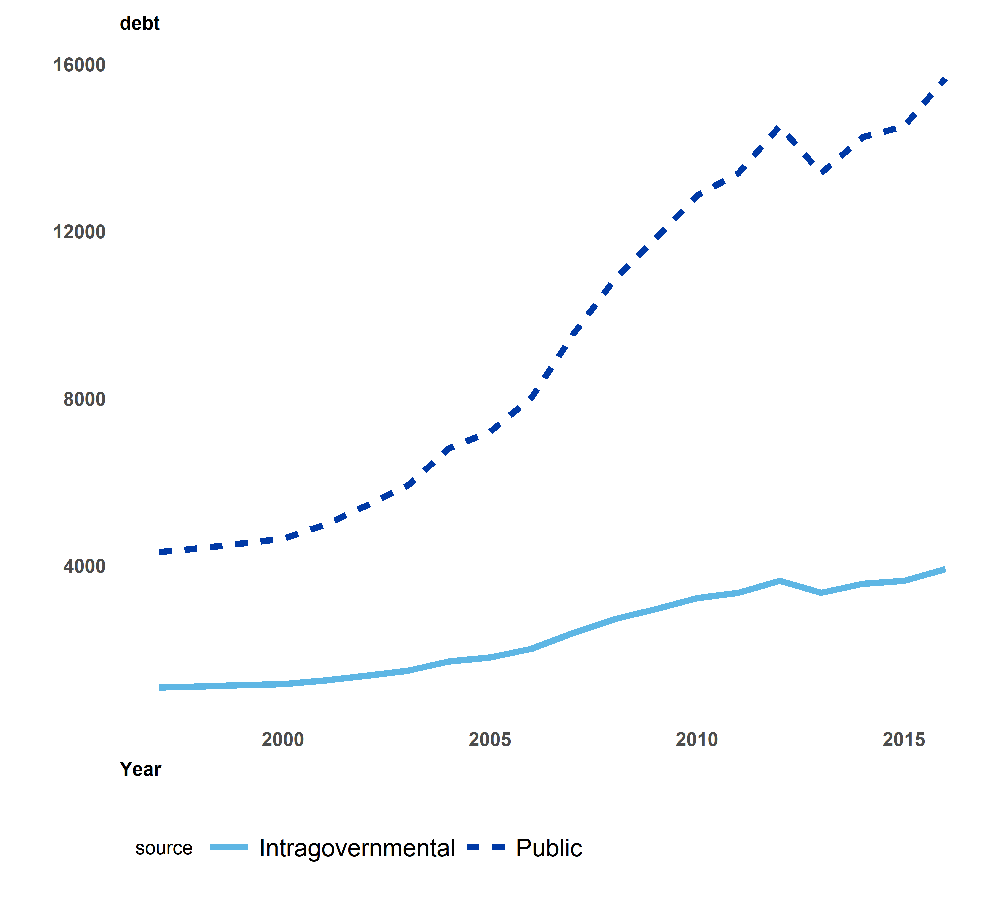

# welcome to autoggraph
GAO's grammar of graphics

## hit 'plots' above to get started, or read the notes on usage below

### data standards

- data uploaded to autoggraph should be clean, tidy, and long.
	- clean data are free of missing and erroneous values
	- tidy data have a header row, and only contain one variable per observation.
	- long data something about observations as levels rather than as variables

### wide vs. long data

these data are wide:

|time       |     X|    Y|     Z| 
|:---------:|:----:|:---:|:----:|
|2009-01-01 | -0.56| 2.45| -4.27| 
|2009-01-02 | -0.23| 0.72| -0.87|
|2009-01-03 |  1.56| 0.80| -4.10|

these are the same data in long form:

|time       |stock | price| 
|:---------:|:----:|:----:| 
|2009-01-01 |X     | -0.56| 
|2009-01-02 |X     | -0.23| 
|2009-01-03 |X     |  1.56| 
|2009-01-01 |Y     |  2.45| 
|2009-01-02 |Y     |  0.72| 
|2009-01-03 |Y     |  0.80| 
|2009-01-01 |Z     | -4.27| 
|2009-01-02 |Z     | -0.87| 
|2009-01-03 |Z     | -4.10|

questions about making a wide dataset into a long one? talk to a data analyst or methodologist.

### example plots

	

		
density plot

		
	

	

		
scatterplot

		
	

	

		
line graphs

		
	

	

		
area charts

		
	

### questions?
[send an email](mailto:shiny@gao.gov&subject=autoggraph)

